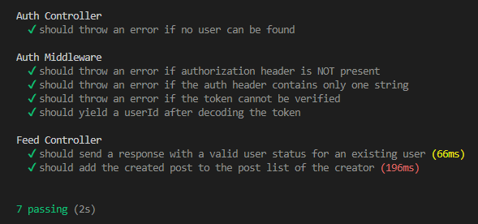

LifeNode
================

General Info
------------
> LifeNode is the server side of a social media web application. It's a Rest Web Service. 
> Using: NodeJS, Express, EJS, MongoDB, Websockets, Authentication, JWT, Validators, Mocha, Chai

### Features
* POST, GET AND PUT requests for -Login, Sign up, Update status, Create View and Delete post-
* NoSQL Database system using MongoDB, Mongoose
* Mocha and Chai for Unit Tests

### Screenshots

> Test Results 
