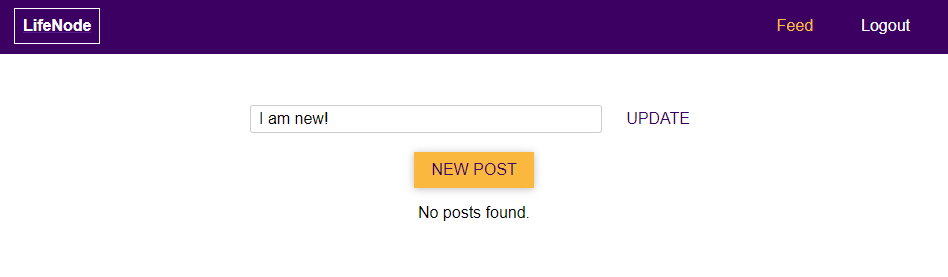
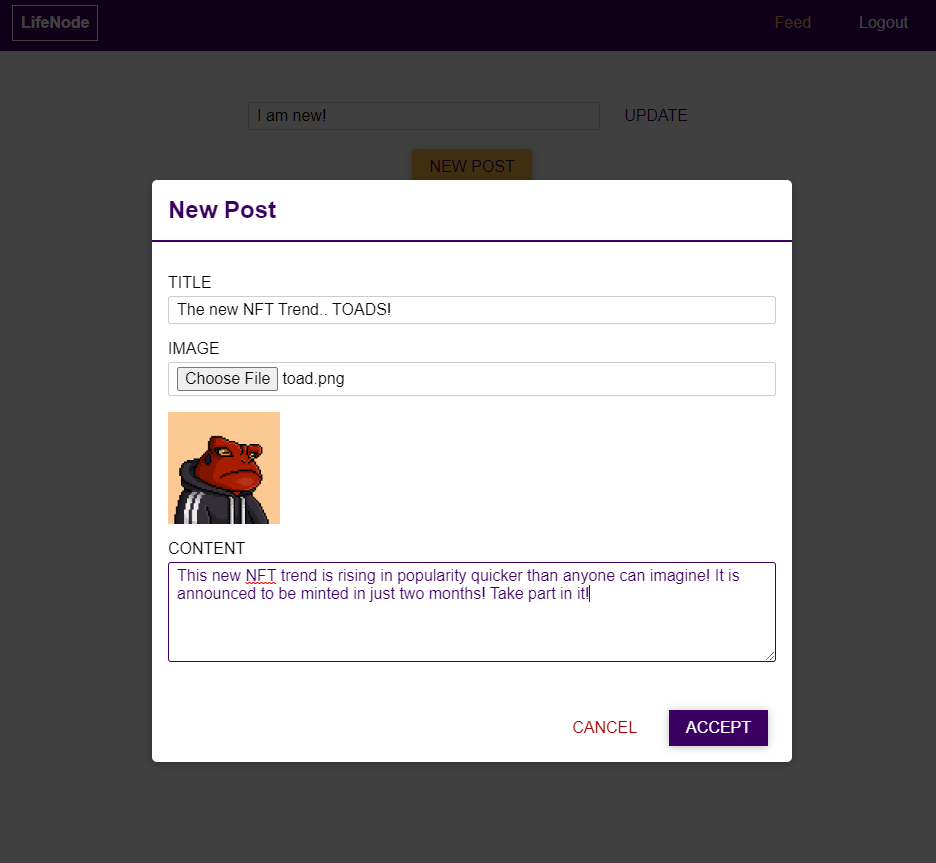
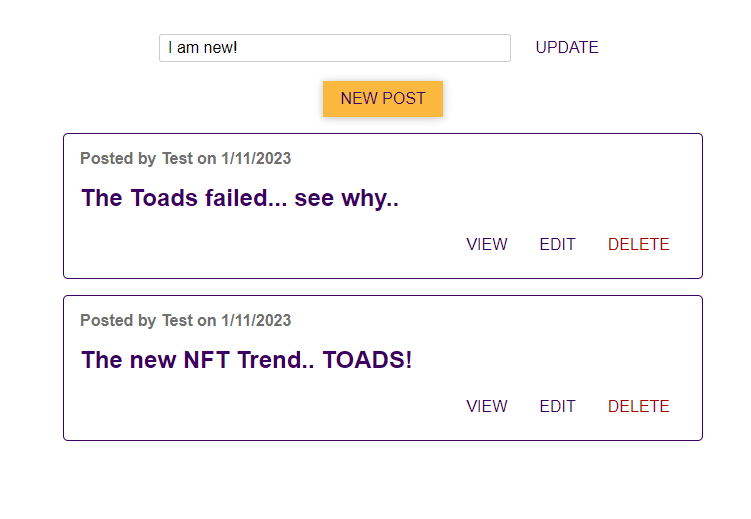
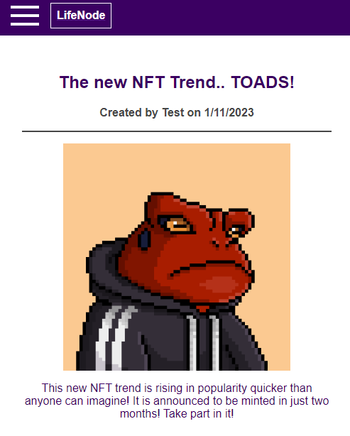

LifeNode
================

General Info
------------
> LifeNode is a full-stack social media web application.<br>
> Using: NodeJS, ReactJS, Express, MongoDB, Websockets, Authentication, JWT, Validators, Mocha, Chai

### Features
* POST, GET AND PUT requests for -Login, Sign up, Update status, Create View and Delete post-
* NoSQL Database system using MongoDB, Mongoose
* Socket.io to simultaneously update every client when posts change.
* Responsive Design for both Web and Mobile
* Mocha and Chai for Unit Tests

### Installation
#### Requirements
- Node to be installed.
- Preferrably VSCode (Visual Studio Code) to be installed.

#### By Cloning
  > * You need to clone both the backend (master branch) and the frontend (frontend branch) <br>
  > * Open terminal, go to whicever directory you want this app to be cloned into, then type these commands: <br>
  > ```
  >  git clone https://github.com/Burakcoli/lifenode.git
  >  git clone --branch frontend https://github.com/Burakcoli/lifenode.git
  >  ```
  > * After cloning, open two VSCode windows. <br>
  > * In the first one choose the Backend folder, in the second one choose the frontend folder. <br>
  > * In the toolbar, click on Terminal and then New Terminal (for both windows). <br>
  > * Type `npm install` in both projects to install required packages. <br>
  > * After it's done, type `npm start` in both terminals and both the frontend and backend will start. <br>
  > * Open your browser and go to 'localhost:3000' to see the frontend in action. <br>

#### By Downloading
  > * It will be the same steps in the cloning section, after the git clone commands.
  > * Click on Code and then Download Zip File for both branches.
  > * Download the folders to anywhere you like, and then open two VSCode windows and continue the steps above (in By Cloning section).

### Screenshots

> Test Results<br>  <br>
> Home Page<br>  <br>
> Creating A Post <br>  <br>
> Feed <br>  <br>
> Viewing A Post In Mobile <br>  <br>
